

| Assignment | Student   |
| ---------- | --------- |
| Module-1   | Robin Dua |

---

| Part | Step | Description | gcloud cli command (bash) or console | Results (ScreenPrint) | Notes |
| :--- | :--- | :---------- | :----------------------------------- | :-------------------- | :---- |
| Pre-Flight | 1 | Create BigQuery Dataset | `bq mk --dataset --location=US \` `--description="Week 1 - rdua1" \` `$GOOGLE_CLOUD_PROJECT:rdua1_ml` | 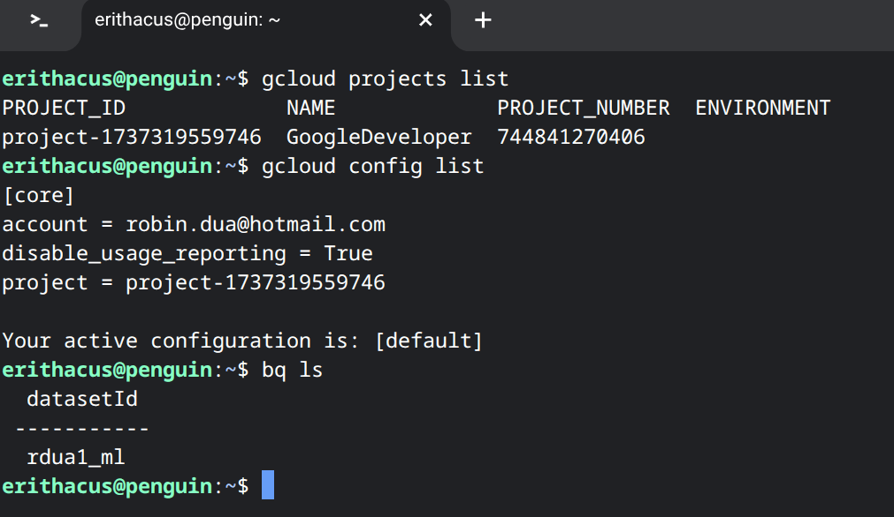 | verify the configured project and bq dataset |
| Pre-Flight | 2.1 | Enable Cloud Build API | `gcloud services enable cloudbuild.googleapis.com`| N/A | Service needs to be enabled before adding permissions on SA |
| Pre-Flight | 2.2  | Grant Cloud Build Deployment Permissions | `PROJECT_NUM=$(gcloud projects describe $GOOGLE_CLOUD_PROJECT \` `--format="value(projectNumber)")`  `CB_SA="${PROJECT_NUM}@cloudbuild.gserviceaccount.com"`  `for ROLE in roles/run.admin roles/iam.serviceAccountUser; do` `gcloud projects add-iam-policy-binding $GOOGLE_CLOUD_PROJECT \` `--member="serviceAccount:${CB_SA}" --role="$ROLE"` `done` | 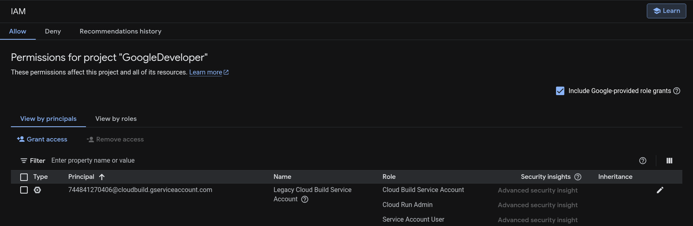  | Console View |

---

 
 
 

| Part | Step | Description | gcloud cli command (bash) or console | Results (ScreenPrint) | Notes |
| :--- | :--- | :---------- | :----------------------------------- | :-------------------- | :---- |
| Part-1 | 1 | Create Model and Train | `Console > BigQuery > Studio > Classic Explorer > Query Editor` | 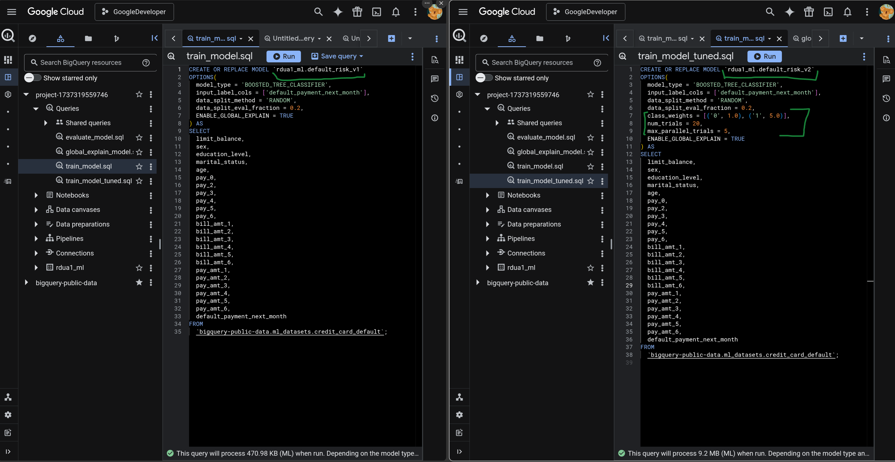 | Added weight tuning to improve recall to catch more defaulters |
| Part-1 | 2 | Model Evaluation | `Console > BigQuery > Studio > Classic Explorer > Query Editor` | 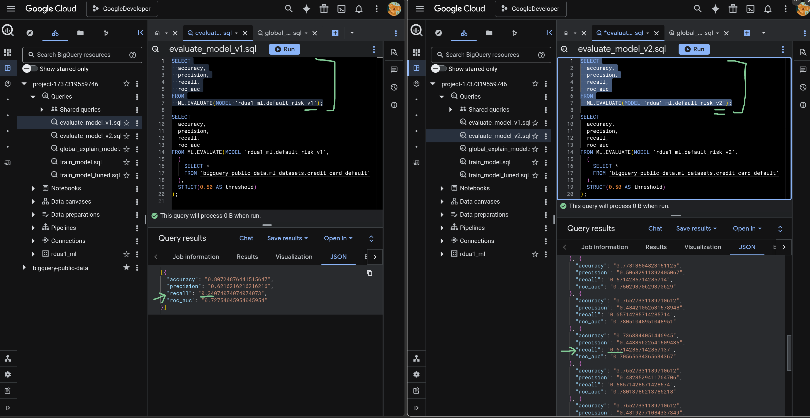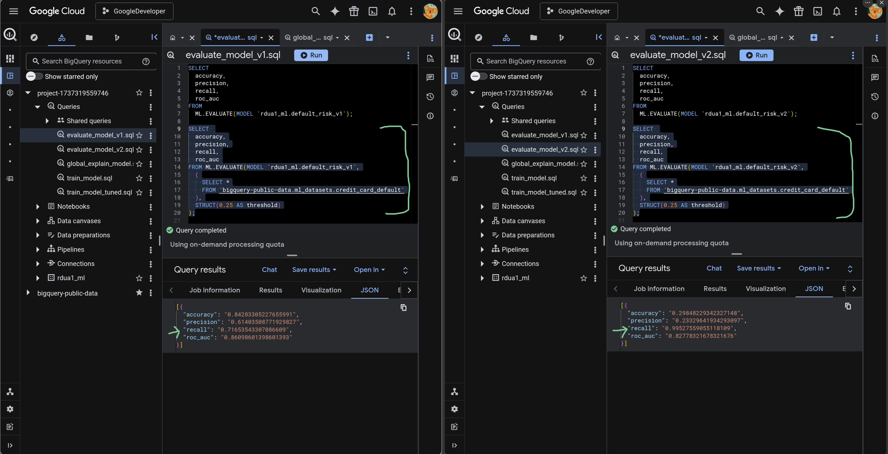 | Difference b/w V1 & V2 Model Evaluate |
| Part-1 | 3  | Model Global Explain | `Console > BigQuery > Studio > Classic Explorer > Query Editor` | 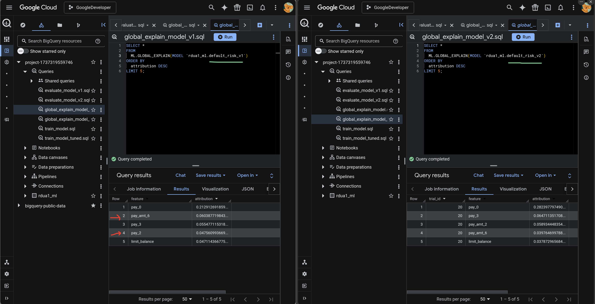  | Difference b/w V1 & V2 Model Explain |

---

 
 
 

| Part | Step | Description | gcloud cli command (bash) or console | Results (ScreenPrint) | Notes |
| :--- | :--- | :---------- | :----------------------------------- | :-------------------- | :---- |
| Part-2 | 1 | Resolve permissions on compute service account before deploying | `PROJECT_NUM=$(gcloud projects describe $GOOGLE_CLOUD_PROJECT \` `--format="value(projectNumber)")`  `COMPUTE_SA="${PROJECT_NUM}-compute@developer.gserviceaccount.com"`  `for ROLE in roles/artifactregistry.reader roles/artifactregistry.writer roles/logging.logWriter roles/bigquery.jobUser roles/bigquery.dataViewer; do` `gcloud projects add-iam-policy-binding $GOOGLE_CLOUD_PROJECT \` `--member="serviceAccount:${COMPUTE_SA}" --role="$ROLE"` `done` | 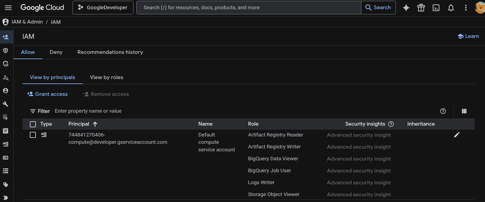 | Console View |
| Part-2 | 2 | Cloud Run Deployment  (using source, via CLI) | `gcloud run deploy rdua1-inference-api \` `--source . \` `--region us-east1 \` `--min-instances 0 \` `--memory 512Mi \` `--timeout 30 \` `--no-allow-unauthenticated \` `--set-env-vars ENVIRONMENT=production` | 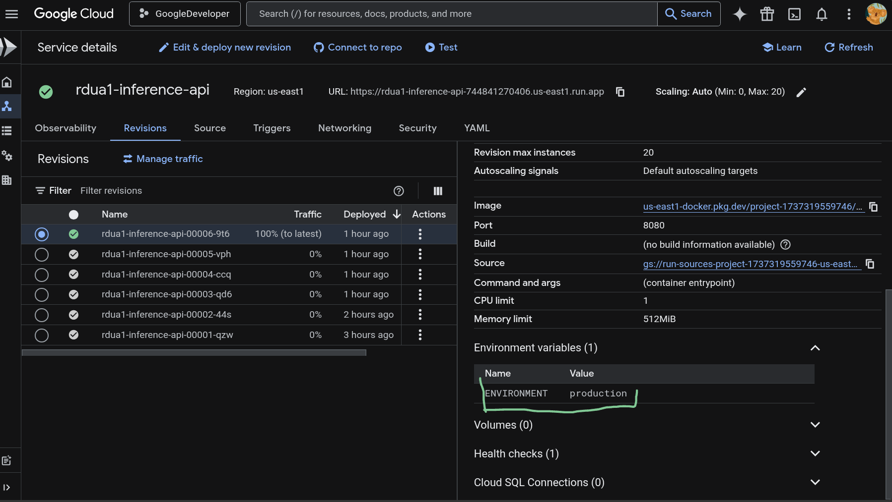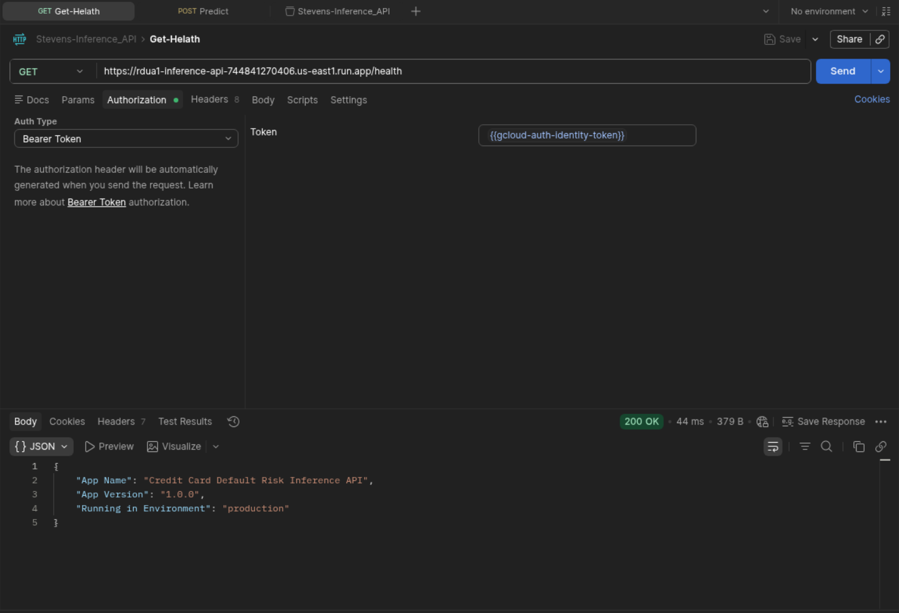 | Deployed Cloud Run Service With Env Vars - Console View |
| Part-2 | 3  | API Code (GitHub) | Inference API With /predict Endpoint | [Please Refer Here](./FastAPI/) |  |
| Part-2 | 4  | Cloud Run API Testing | Postman With Authorization Header  `gcloud auth print-identity-token` | 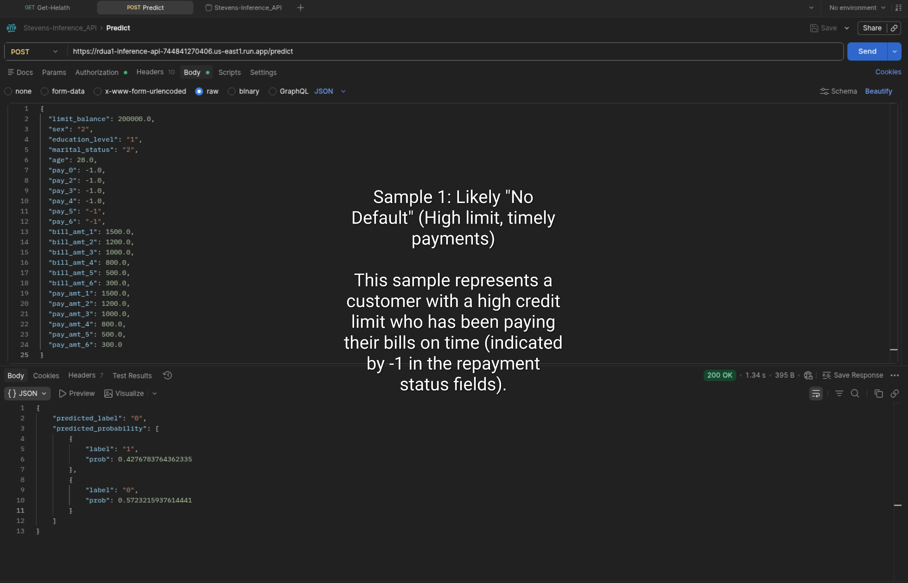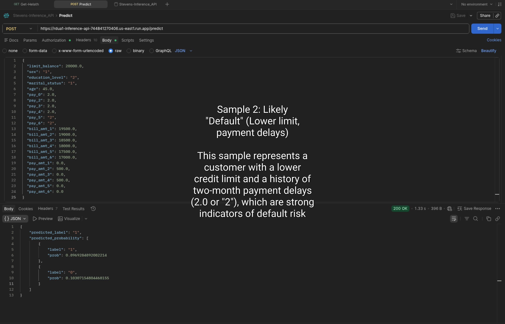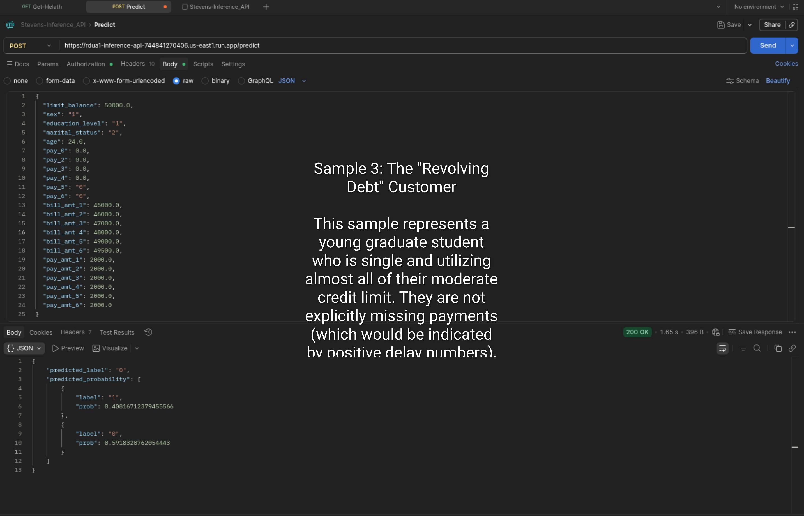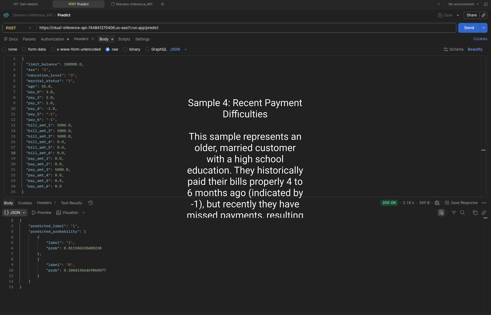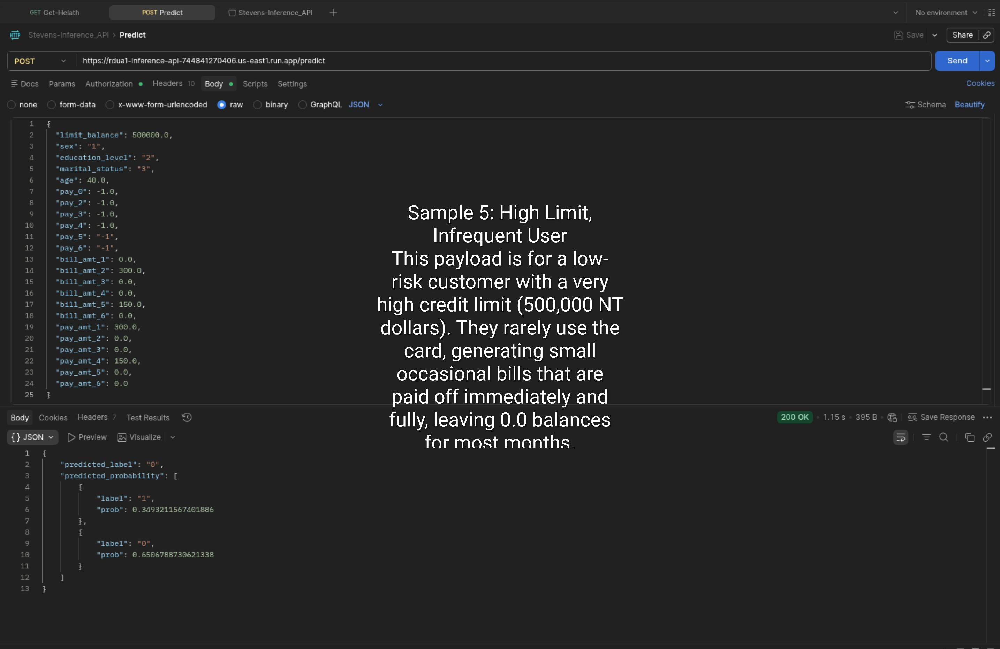  | Difference b/w V1 & V2 Model Explain |

---

 
 
 

| Part | Step | Description | gcloud cli command (bash) or console | Results (ScreenPrint) | Notes |
| :--- | :--- | :---------- | :----------------------------------- | :-------------------- | :---- |
| Part-3 | 1 | Resolve permissions on compute service account before deploying | `PROJECT_NUM=$(gcloud projects describe $GOOGLE_CLOUD_PROJECT \` `--format="value(projectNumber)")`  `COMPUTE_SA="${PROJECT_NUM}-compute@developer.gserviceaccount.com"`  `for ROLE in roles/run.admin roles/iam.serviceAccountUser roles/cloudbuild.builds.editor roles/artifactregistry.admin roles/storage.admin; do` `gcloud projects add-iam-policy-binding $GOOGLE_CLOUD_PROJECT \` `--member="serviceAccount:${COMPUTE_SA}" --role="$ROLE"` `done` | 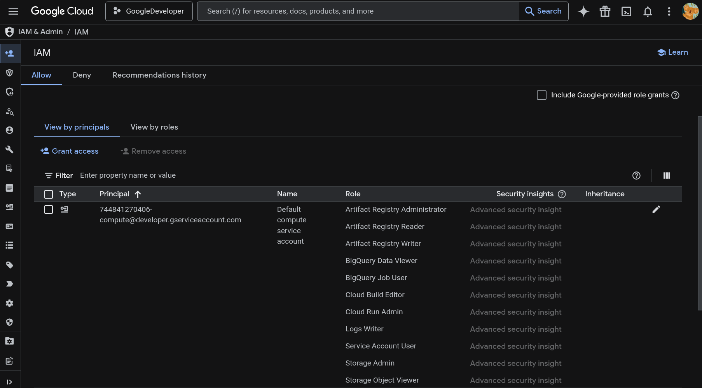 | Console View |
| Part-3 | 2  | API Code (GitHub) | tests & cloudbuild.yaml | [Please Refer Here](./FastAPI/) |  |
| Part-3 | 3 | Cloud Run Deployment  (using source, via CI/CD CloudBuild) | `gcloud builds submit --region=us-east1 --config=cloudbuild.yaml .` | 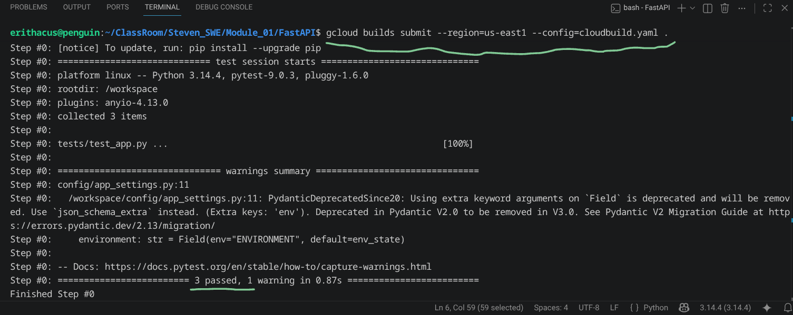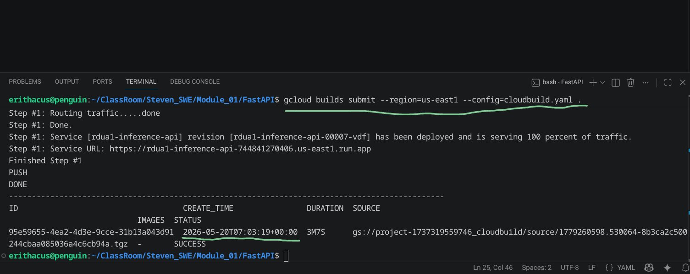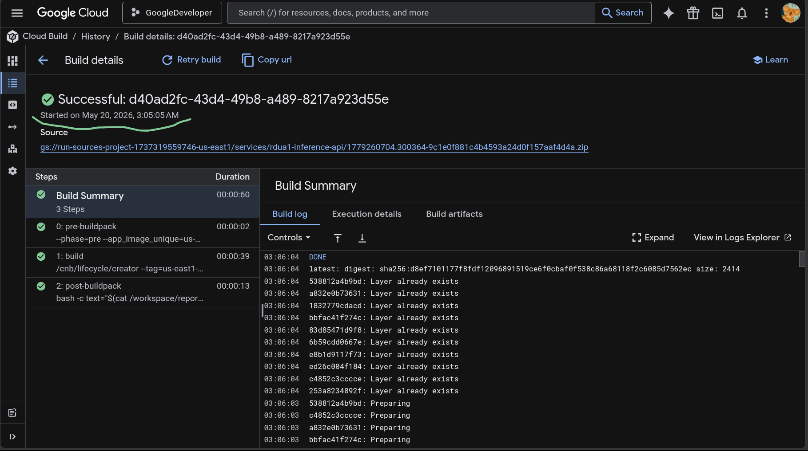 | Build Logs From Terminal, And Build history From Console View|

---

 
 
 

| Part | Step | Description | gcloud cli command (bash) or console | Results (ScreenPrint) | Notes |
| :--- | :--- | :---------- | :----------------------------------- | :-------------------- | :---- |
| Part-4 | 1 | Create Workbench Instance | `gcloud workbench instances create rdua1-eda \` `--location=us-east1-b \` `--machine-type=e2-standard-4 \` `--metadata=idle-timeout-minutes=30` | 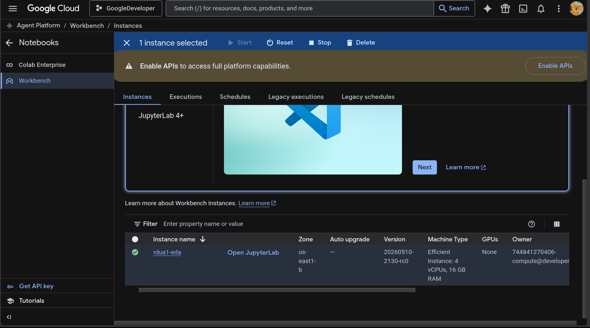 | Console View |
| Part-4 | 2  | Jupyter EDA (GitHub) | Jupyter Notebook with Outputs | [Please Refer Here](./JupyterEDA/credit_default_eda.ipynb) |  |

---

