

| Assignment | Student   |
| ---------- | --------- |
| Module-2   | Robin Dua |

---

| Part | Step | Description | gcloud cli command (bash) or console | Results (ScreenPrint) | Notes |
| :--- | :--- | :---------- | :----------------------------------- | :-------------------- | :---- |
| Pre-Flight | 1 | Enable Required API's | `gcloud services enable aiplatform.googleapis.com \` `discoveryengine.googleapis.com \` `run.googleapis.com` | 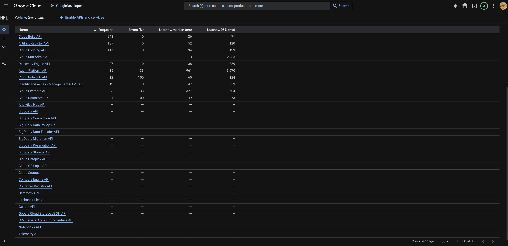 | Console View |
| Pre-Flight | 2 | Bucket + Data Store For Manuals | 1: Download CMS Manuals [Internet Only Manuals, Pub 100-02 (Medicare Benefit Policy Manual), 16 Chapters]:   `mkdir -p cms_manual && cd cms_manual`  `for i in $(seq -w 1 16); do` `curl -fsSL -O "https://www.cms.gov/Regulations-and-Guidance/\` `Guidance/Manuals/Downloads/bp102c${i}.pdf"` `done` `curl -fsSL -O "https://www.cms.gov/Regulations-and-Guidance/Guidance/Manuals/Downloads/bp102c03pdf.pdf"` `curl -fsSL -O "https://www.cms.gov/Regulations-and-Guidance/Guidance/Manuals/Downloads/bp102c08pdf.pdf"`  2: Create Cloud Storage Bucket  `gcloud storage buckets create gs://rdua1-stevens-swe-20049317 \` `--location=us-east1 \` `--default-storage-class=standard`  3: Create AI Applications - Data Store (Via Console)  `AI Applications > Data Stores > Create Data Store > Choose 'Cloud Storage' for Source > Choose 'Documents' under 'Unstructured Data Import' > Choose Bucket & Folder > Continue` | 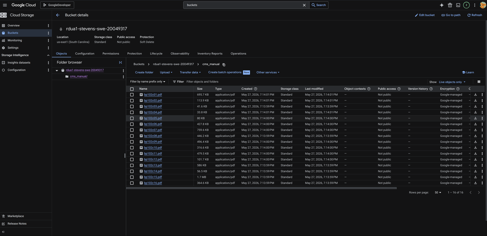 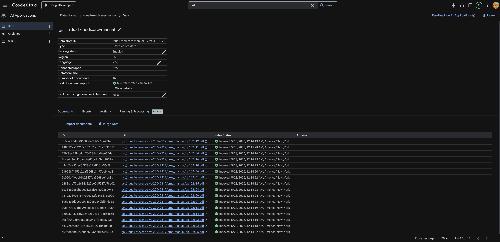 | Console View |
---

 
 
 

| Part | Step | Description | gcloud cli command (bash) or console | Results (ScreenPrint) | Notes |
| :--- | :--- | :---------- | :----------------------------------- | :-------------------- | :---- |
| Task-01 | 1 | Resolve permissions on compute service account before deploying | `PROJECT_NUM=$(gcloud projects describe $GOOGLE_CLOUD_PROJECT \` `--format="value(projectNumber)")`  `COMPUTE_SA="${PROJECT_NUM}-compute@developer.gserviceaccount.com"`  `for ROLE in roles/aiplatform.user; do` `gcloud projects add-iam-policy-binding $GOOGLE_CLOUD_PROJECT \` `--member="serviceAccount:${COMPUTE_SA}" --role="$ROLE"` `done` | 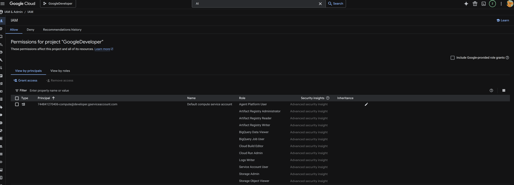 | Console View |
| Task-01 | 2 | API Code (GitHub) | `Chat API Without Grounding First` | [Please Refer Here](./FastAPI_Task01/) | API Code For Task01 |
| Task-01 | 3 | Cloud Run Deployment  (using source, via CLI) | `gcloud run deploy rdua1-medicare-policy-chat-api \` `--source . \` `--region us-east1 \` `--min-instances 0 \` `--max-instances 1 \` `--memory 512Mi \` `--timeout 30 \` `--no-allow-unauthenticated \` `--set-env-vars ENVIRONMENT=production` | 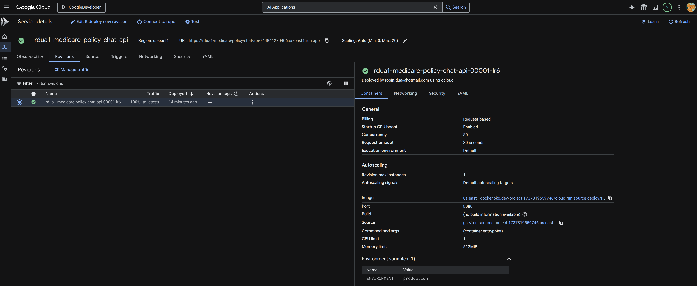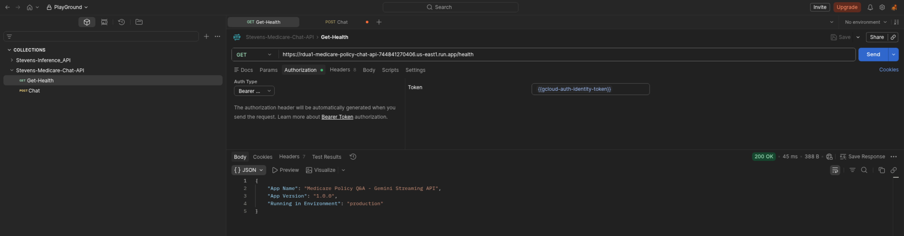 | Deployed Cloud Run Service With Env Vars - Console View |
| Task-01 | 4 | Chat API Testing With Authorization  (using Curl/Postman) | 1: Health Check:  `curl -N -X GET https://rdua1-medicare-policy-chat-api-744841270406.us-east1.run.app/health \` `-H "Authorization: Bearer $(gcloud auth print-identity-token)"`  2: Chat Request-1:  `curl -N -X POST https://rdua1-medicare-policy-chat-api-744841270406.us-east1.run.app/chat \` `-H "Content-Type: application/json" \` `-H "Authorization: Bearer $(gcloud auth print-identity-token)" \` `-d '{"message": "What is the Capital of France?"}'`  3: Chat Request-2:  `curl -N -X POST https://rdua1-medicare-policy-chat-api-744841270406.us-east1.run.app/chat \` `-H "Content-Type: application/json" \` `-H "Authorization: Bearer $(gcloud auth print-identity-token)" \` `-d '{"message": "What is medicare?"}'` | 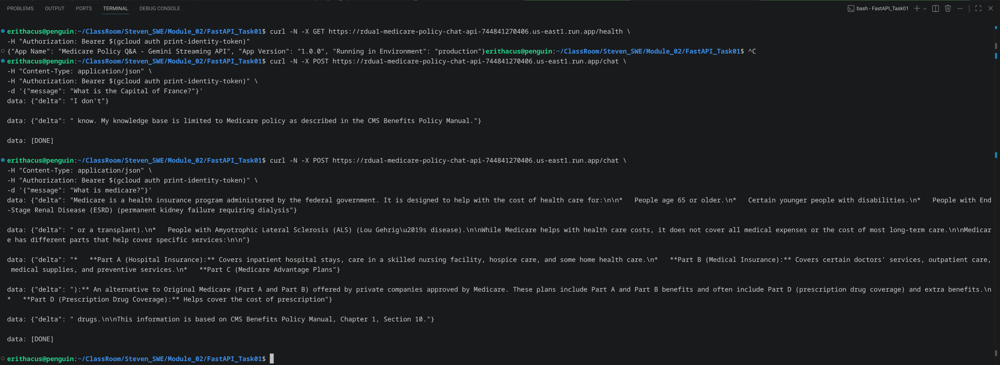 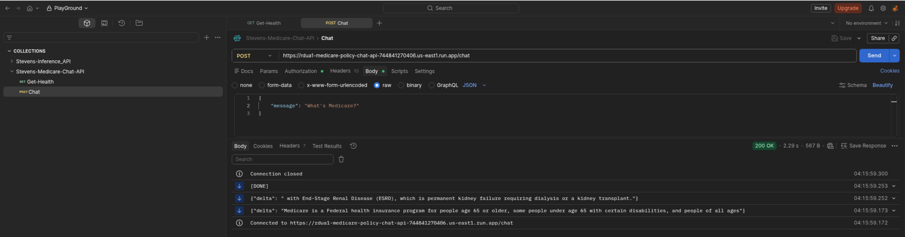 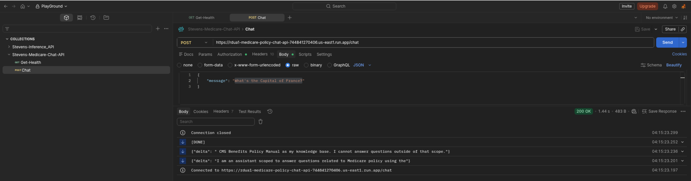| Curl & Postman Testing |
---

 
 
 

| Part | Step | Description | gcloud cli command (bash) or console | Results (ScreenPrint) | Notes |
| :--- | :--- | :---------- | :----------------------------------- | :-------------------- | :---- |
| Task-02 | 1 | Resolve permissions on compute service account before deploying | `PROJECT_NUM=$(gcloud projects describe $GOOGLE_CLOUD_PROJECT \` `--format="value(projectNumber)")`  `COMPUTE_SA="${PROJECT_NUM}-compute@developer.gserviceaccount.com"`  `for ROLE in roles/discoveryengine.viewer; do` `gcloud projects add-iam-policy-binding $GOOGLE_CLOUD_PROJECT \` `--member="serviceAccount:${COMPUTE_SA}" --role="$ROLE"` `done` | 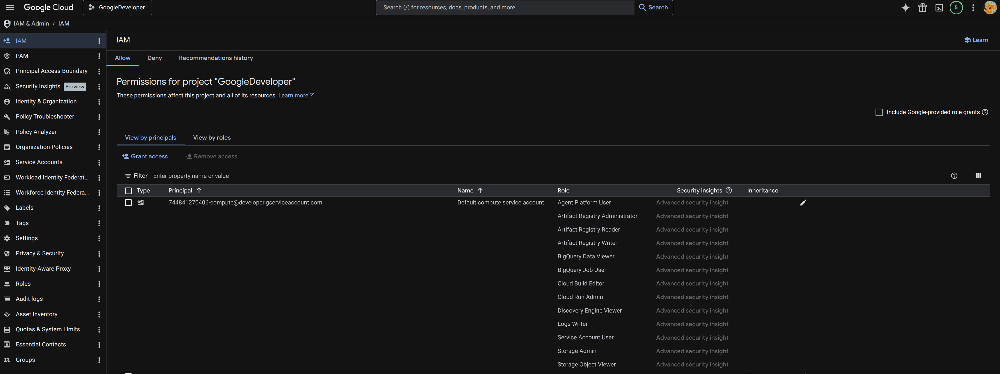 | Console View |
| Task-02 | 2 | API Code (GitHub) | `Chat API Without Grounding First` | [Please Refer Here](./FastAPI_Task02/) | API Code For Task02 |
| Task-02 | 3 | Cloud Run Deployment  (using source, via CLI) | `gcloud run deploy rdua1-medicare-policy-chat-api \` `--source . \` `--region us-east1 \` `--min-instances 0 \` `--max-instances 1 \` `--memory 512Mi \` `--timeout 30 \` `--no-allow-unauthenticated \` `--set-env-vars ENVIRONMENT=production` | 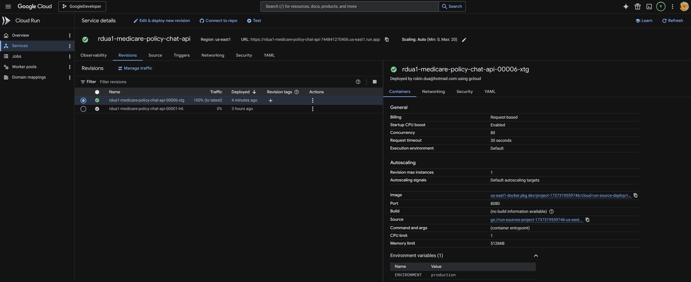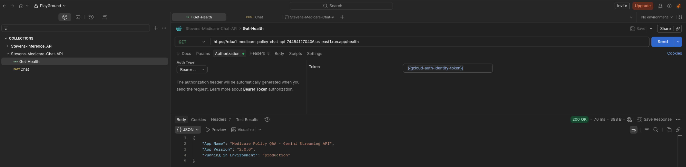 | Deployed Cloud Run Service With Env Vars - Console View |
| Task-02 | 4 | Chat API Testing With Authorization  (using Postman) | `1: Golden Question-1, Chapter 8`  `2: Golden Question-9, Chapter 1`  `3: Golden Question-15, Chapter 9` | 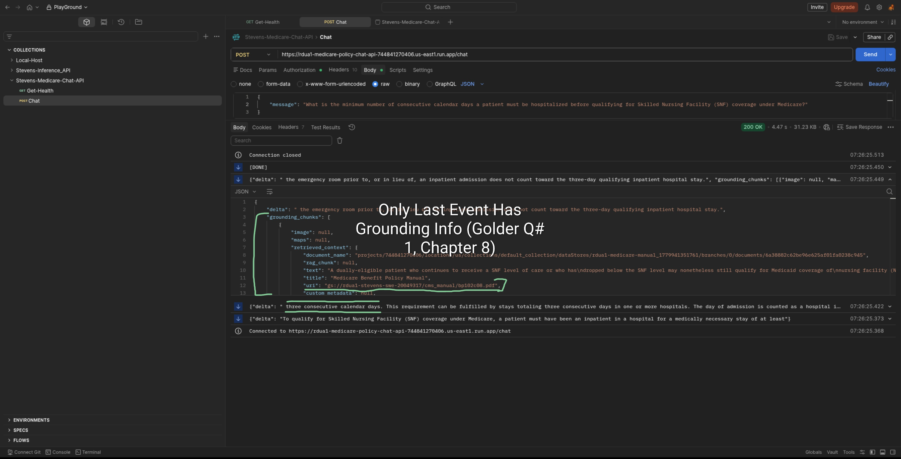 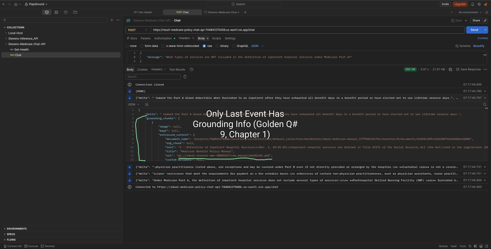 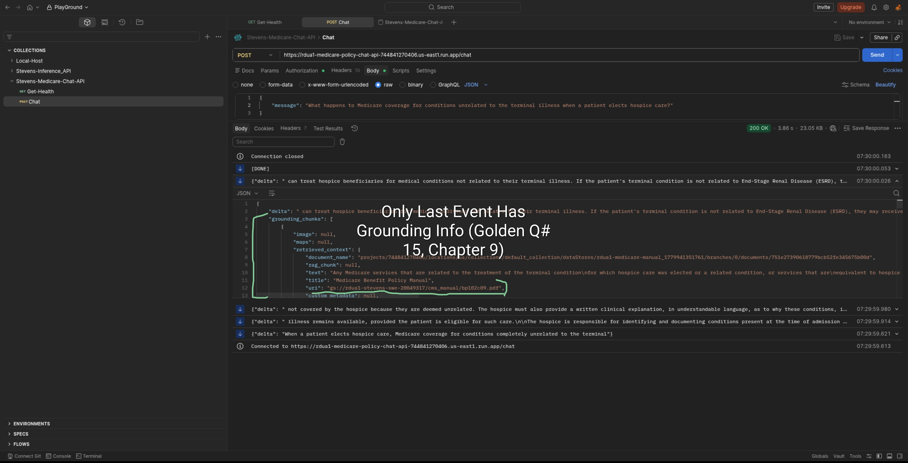| Postman Testing Using Golden Set Questions|
---

