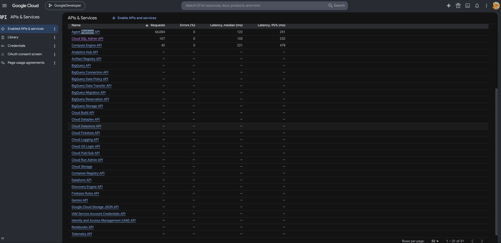
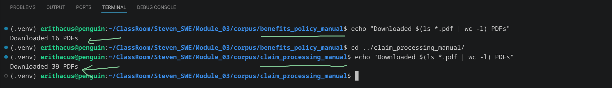
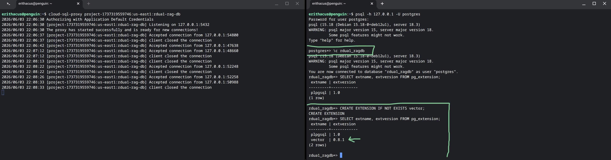
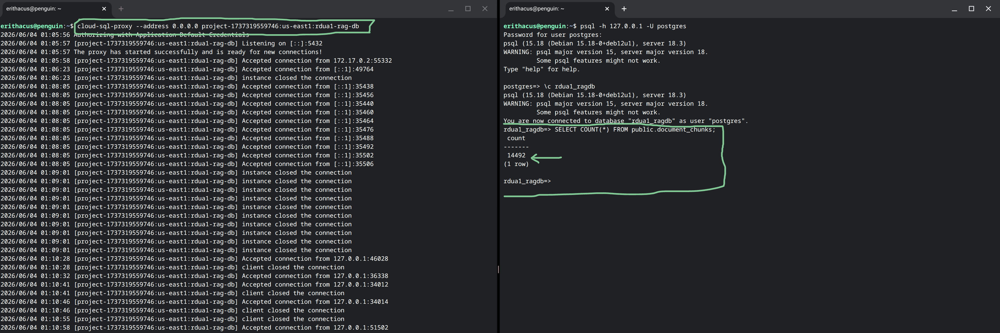
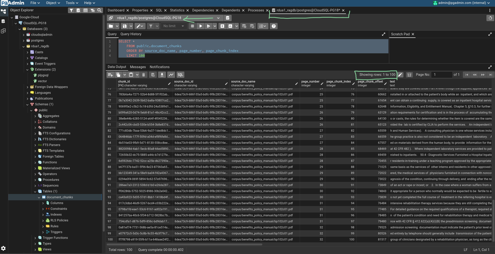
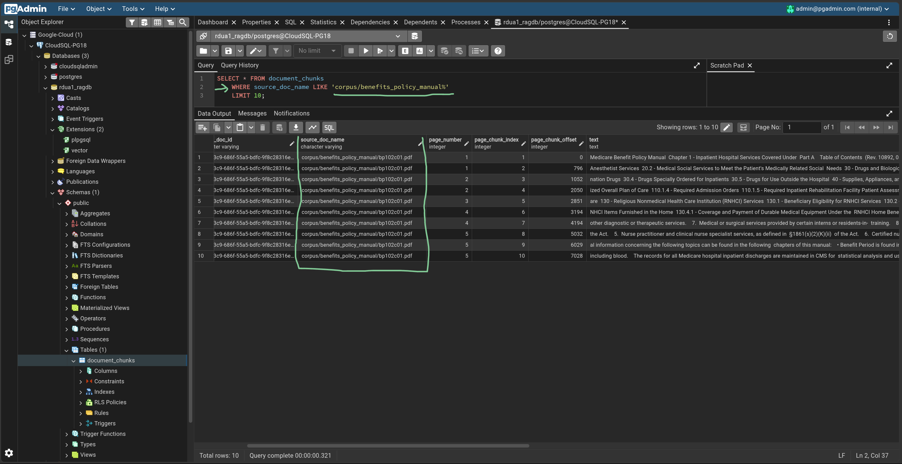
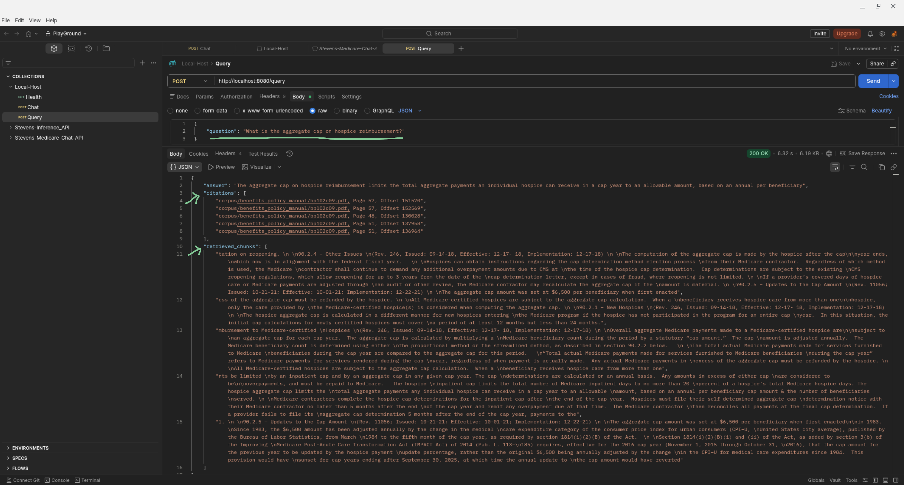
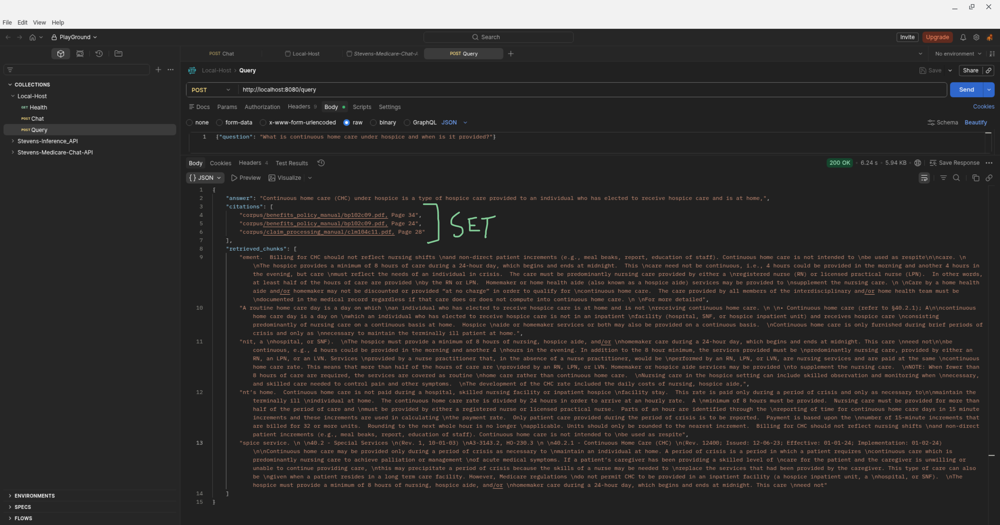
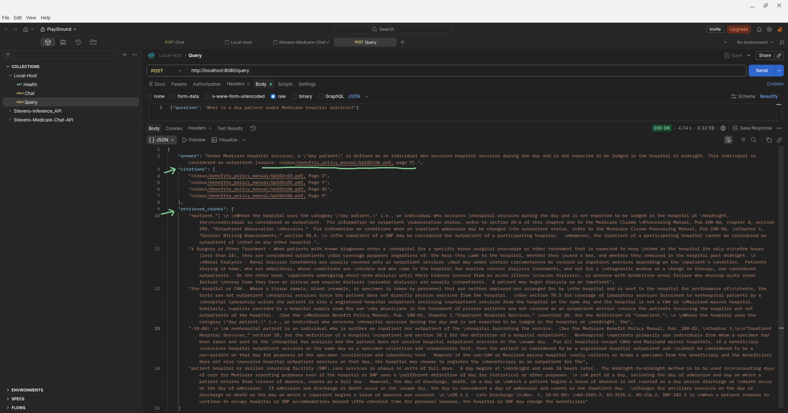

| Assignment | Student   |
| ---------- | --------- |
| Module-3   | Robin Dua |

---

| Part | Step | Description | gcloud cli command (bash) or console | Results (ScreenPrint) | Notes |
| :--- | :--- | :---------- | :----------------------------------- | :-------------------- | :---- |
| Pre-Flight-1 | 1 | Enable Required API's | `gcloud services enable aiplatform.googleapis.com \` `sqladmin.googleapis.com run.googleapis.com` |  | Console View |
| Pre-Flight-1 | 2 | Create Cloud SQL Instance For Postgres Database | 1: Create Cloud SQL Instance For Postgres Database:   `gcloud sql instances create rdua1-rag-db \` `--edition=ENTERPRISE \` `--database-version=POSTGRES_18 \` `--tier=db-f1-micro \` `--region=us-east1`  2: Create Database on the instance  `gcloud sql databases create rdua1_ragdb \` `--instance=rdua1-rag-db`  3: Set password for default user 'postgres' on the instance  `gcloud sql users set-password postgres \` `--instance=rdua1-rag-db \` `--prompt-for-password` | | Note: This provisioning may take some time |
---

 
 
 

| Part | Step | Description | gcloud cli command (bash) or console | Results (ScreenPrint) | Notes |
| :--- | :--- | :---------- | :----------------------------------- | :-------------------- | :---- |
| Pre-Flight-2 | 1 | Download CMS Manuals | 1: Download CMS Policy Manuals [Internet Only Manuals, Pub 100-02 (Medicare Benefit Policy Manual), 16 Chapters]:  `mkdir -p cms_manual && cd cms_manual`  `for i in $(seq -w 1 16); do` `curl -fsSL -O "https://www.cms.gov/Regulations-and-Guidance/\` `Guidance/Manuals/Downloads/bp102c${i}.pdf"` `done` `curl -fsSL -O "https://www.cms.gov/Regulations-and-Guidance/Guidance/Manuals/Downloads/bp102c03pdf.pdf"` `curl -fsSL -O "https://www.cms.gov/Regulations-and-Guidance/Guidance/Manuals/Downloads/bp102c08pdf.pdf"`  2: Download CMS Claim Manuals [Internet Only Manuals, Pub 100-04 (Medicare Claims Processing Manual), 39 Chapters]  `for i in $(seq -w 1 38); do` `curl -fsSL -O "https://www.cms.gov/Regulations-and-Guidance/\` `Guidance/Manuals/Downloads/clm104c${i}.pdf"` `done` `curl -fsSL -O "https://www.cms.gov/Regulations-and-Guidance/Guidance/Manuals/Downloads/chapter-39-opioid-treatment-programs-otps.pdf"` |    [Please Refer Here For Downloaded Manuals](./corpus/) | Terminal View & GitHub Path |
---

 
 
 

| Part | Step | Description | gcloud cli command (bash) or console | Results (ScreenPrint) | Notes |
| :--- | :--- | :---------- | :----------------------------------- | :-------------------- | :---- |
| Pre-Flight-3 | 1 | Setup Cloud SQL Auth Proxy | 1: Download Cloud SQL Auth Proxy  `curl -o cloud-sql-proxy https://storage.googleapis.com/cloud-sql-connectors/cloud-sql-proxy/v2.22.0/cloud-sql-proxy.linux.amd64`  2: Make the Cloud SQL Auth Proxy executable  `chmod +x cloud-sql-proxy` |  | will use it later in the module |
---

## Architecture & Design Choices

* **Chunk Size and Overlap:** We implemented a **fixed-size chunking strategy with a maximum of 1,200 characters per chunk and a 200-character overlap**. This character limit ensures we stay safely within the 2,048-token input limit of the `gemini-embedding-001` embedding model. The 200-character overlap prevents the fragmentation of meaning at the boundaries, ensuring that context isn't lost if a sentence is split.

* **Vector Index Architecture (HNSW):** We utilize an **HNSW (Hierarchical Navigable Small World) index via PostgreSQL/pgvector**. HNSW was selected because it delivers very low-latency approximate nearest-neighbor search for medium-scale corpora (under 50 million vectors) and **supports incremental updates**, meaning we can continuously ingest new policy documents without having to rebuild the entire index. Additionally, using `pgvector` allows us to combine our vector similarity searches with structured SQL data filters (like document metadata) in a single query.

* **Top-K Retrieval:** Our retrieval step targets a Top-5 optimized to balance recall and precision (often evaluated as **recall@10** in our testing). We constrain the number of returned chunks to ensure the language model has enough contextual data to answer the prompt accurately, without retrieving so many chunks that the semantic signal is diluted by irrelevant noise.

* **Vector Dimension Size:** We configured our `gemini-embedding-001` model to output **768-dimensional vectors** instead of the default 3,072. By leveraging Matryoshka Representation Learning (MRL), truncating to 768 dimensions allows us to retain approximately 95–97% of full recall while achieving a 4x reduction in storage costs and faster nearest-neighbor search latency. This 768-dimension target serves as a practical, optimal baseline for balancing retrieval performance and memory constraints.
 
 
 

| Part | Step | Description | gcloud cli command (bash) or console | Results (ScreenPrint) | Notes |
| :--- | :--- | :---------- | :----------------------------------- | :-------------------- | :---- |
| Task-01 | 1 | Read the PDF's (load.py) | [Python Code (GitHub)](./rag-assignment/ingest/1.load.py) | [Output Data File](./output_data/all_pdfs_data.json)  [Output Log File](./logs/ingest.log) | Python Code For Task01 Step-1 With Output & Logs |
| Task-01 | 2 | Split into chunks (chunk.py) | [Python Code (GitHub)](./rag-assignment/ingest/2.chunk.py) | [Output Data File](./output_data/all_pdfs_chunks.json)  [Output Log File](./logs/chunk.log) | Python Code For Task01 Step-2 With Output & Logs |
| Task-01 | 3 | Create embeddings (embed.py) | [Python Code (GitHub)](./rag-assignment/ingest/3.embed.py) | [Output Data File](./output_data/split_embeddings/)  [Output Log File](./logs/embed.log) | Python Code For Task01 Step-3 With Output & Logs |
| Task-01 | 4.1 | Enable vector Extension on Cloud SQL | 1: Get Instance Connection Name:  `gcloud sql instances describe rdua1-rag-db --format="value(connectionName)"`  2: Start Proxy On the Connection:  `cloud-sql-proxy --address 0.0.0.0 project-1737319559746:us-east1:rdua1-rag-db`  3: Use a separate Terminal abd Connect To Database via PSQL:  `psql -h 127.0.0.1 -U postgres` |  | Terminal View |
| Task-01 | 4.2 | Save to the database (store.py) | [Python Code (GitHub)](./rag-assignment/ingest/4.store.py) | [Output Log File](./logs/store.log)     | Python Code For Task01 Step-4 With Output & Logs |
---

 
 
 

| Part | Step | Description | gcloud cli command (bash) or console | Results (ScreenPrint) | Notes |
| :--- | :--- | :---------- | :----------------------------------- | :-------------------- | :---- |
| Task-02 | 1 | SQL Scripts (GitHub) |  | [Please Refer Here For All SQL Scripts](./rag-assignment/ingest/sql/) | SQL Scripts For Task02 |
| Task-02 | 2 | Query With Metadata Filter | |  | Metadata Query |
---

 
 
 

| Part | Step | Description | gcloud cli command (bash) or console | Results (ScreenPrint) | Notes |
| :--- | :--- | :---------- | :----------------------------------- | :-------------------- | :---- |
| Task-03 | 1 | API Code (GitHub) With Retrieve (Top-5) & Generate | | [Please Refer Here For retrieve, generate & api code](./rag-assignment/serve/) | Retrieve (Top-5), Generate & API Code For Task03 |
| Task-03 | 2 | API Testing With Full Response | |    | Testing via Postman using questions from the golden set |
---

 
 
 
To ensure the reliability of our CMS Policy Assistant, we evaluated the system against a golden set of **25 questions** using our `eval/run_eval.py` script. The evaluation results (documented in `eval_results.json`) measure two primary rubrics:

* **Factual Accuracy (Mean Score: 3.68):** This rubric evaluates how accurately and comprehensively the generated answer addresses the user's question. It measures whether the pipeline successfully retrieved the right information and formulated the correct response.
* **Faithfulness (Mean Score: 4.12):** This rubric evaluates how strictly the generated answer is grounded in the retrieved context. A high score here indicates that the model is successfully adhering to our strict system prompt to only use the provided policy documents, effectively minimizing hallucinations.

| Part | Step | Description | gcloud cli command (bash) or console | Results (ScreenPrint) | Notes |
| :--- | :--- | :---------- | :----------------------------------- | :-------------------- | :---- |
| Task-04 | 1 | Evaluation Script (GitHub) | | [Please Refer Here For Evaluation Script](./rag-assignment/eval/run_eval.py) | Python Script to Invoke Query API For Every Question (25) in Golden Set For Evaluation |
| Task-04 | 2 | Evaluation Report | | [Please Refer Here For Evaluation Results](./rag-assignment/eval/eval_results.json) | Result of Executing eval.py |
---

