

| Assignment | Student   |
| ---------- | --------- |
| Module-5   | Robin Dua |

---

| Part | Step | Description | gcloud cli command (bash) or console | Results (ScreenPrint) | Notes |
| :--- | :--- | :---------- | :----------------------------------- | :-------------------- | :---- |
| Phase-0 | 1 | Single Agent Setup  [Python Code] | 1: Navigate the Parent Folder Where All the Agents Need To Be Created `cd Module_05/policy_concierge_project`  2: Setup Policy Concierge Agent (Phase 0) `adk create policy_concierge_phase_0` | [Please Refer Here For Code](./policy_concierge_project/policy_concierge_phase_0/) | Please follow adk documentation |
| Phase-0 | 2 | Initial Setup Chat History Covering All Tools  | Start Dev UI For Testing Via Terminal:   1: Navigate the Parent Folder Where All the Agents Folders Are Present `cd Module_05/policy_concierge_project`  2: Start ADK Dev UI `adk web` | 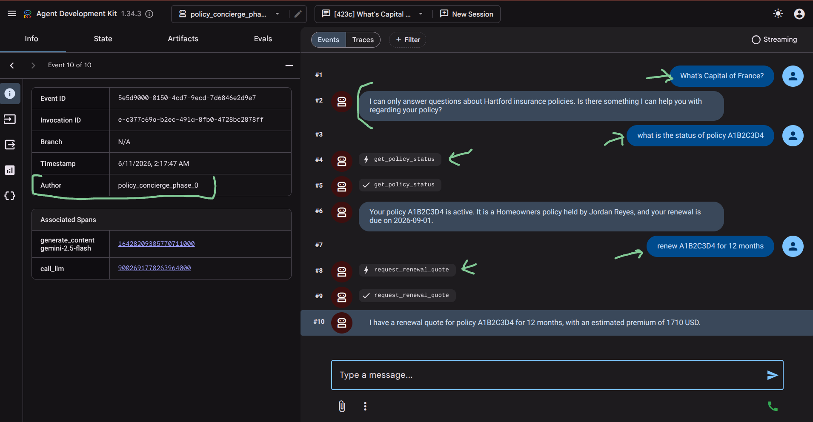 | Local Testing |
---

 
 
 

| Part | Step | Description | gcloud cli command (bash) or console | Results (ScreenPrint) | Notes |
| :--- | :--- | :---------- | :----------------------------------- | :-------------------- | :---- |
| Phase-1 | 1 | Multiple Agent Setup  [Python Code] | 1: Navigate the Parent Folder Where All the Agents Need To Be Created `cd Module_05/policy_concierge_project`  2: Setup Policy Concierge Sequential Agent (Phase 1) `adk create policy_concierge_phase_1` | [Please Refer Here For Code](./policy_concierge_project/policy_concierge_phase_1/) | Please follow adk documentation |
| Phase-2 | 2 | Chat History Covering All Sub Agents  | Start Dev UI For Testing Via Terminal:   1: Navigate the Parent Folder Where All the Agents Folders Are Present `cd Module_05/policy_concierge_project`  2: Start ADK Dev UI `adk web` | 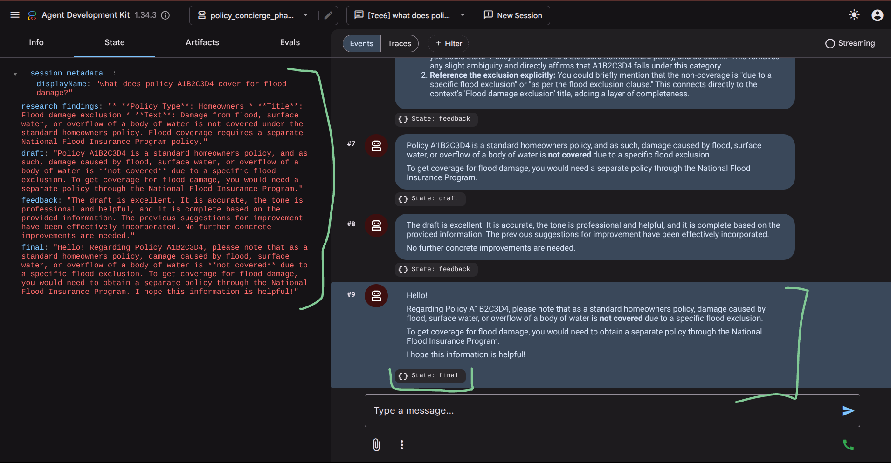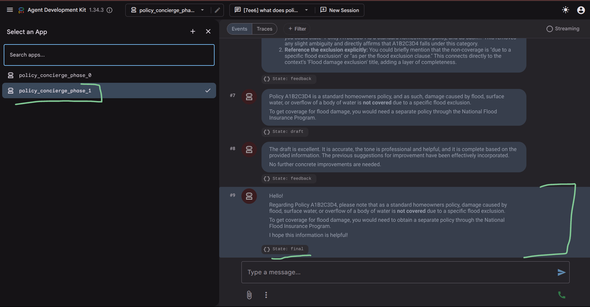 | Local Testing |
---

 
 
 

| Part | Step | Description | gcloud cli command (bash) or console | Results (ScreenPrint) | Notes |
| :--- | :--- | :---------- | :----------------------------------- | :-------------------- | :---- |
| Phase-2 | 1 | Deploy To Agent Engine | `adk deploy agent_engine \` `--project $GOOGLE_CLOUD_PROJECT \` `--region us-east1 \` `--display_name "rdua1-policy-concierge" \` `--trace_to_cloud \` `policy_concierge_phase_1` | 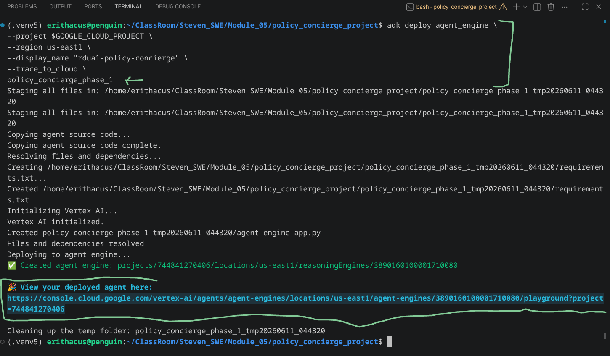 | Terminal View  [Make A Note Of The reasoningEngines Resource ID, will use it to filter Traces later]  |
| Phase-2 | 2 | Agent Engine Testing Via Console/PlayGround | `Console > Agent Platform > Agents > Deployments > rdua1-policy-concierge > Playground` | 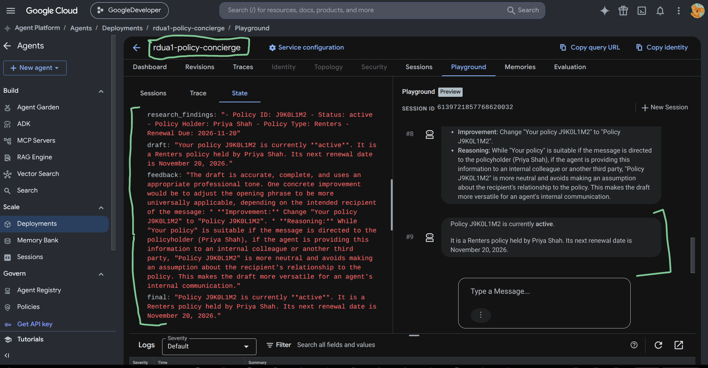 | Console View |
---

 
 
 

| Part | Step | Description | gcloud cli command (bash) or console | Results (ScreenPrint) | Notes |
| :--- | :--- | :---------- | :----------------------------------- | :-------------------- | :---- |
| Phase-3 | 1 | Enable Cloud Trace Service | `gcloud services enable cloudtrace.googleapis.com` | 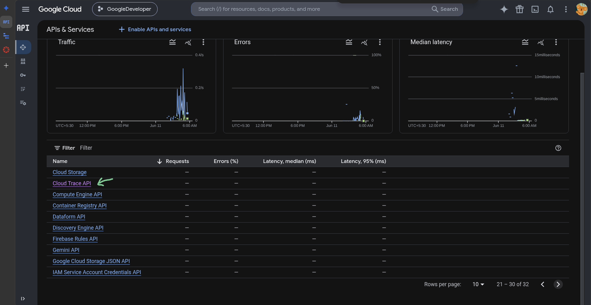 | Console View  |
| Phase-3 | 2 | Agent Engine Testing Via Console/PlayGround For Traces | `Console > Agent Platform > Agents > Deployments > rdua1-policy-concierge > Playground` | 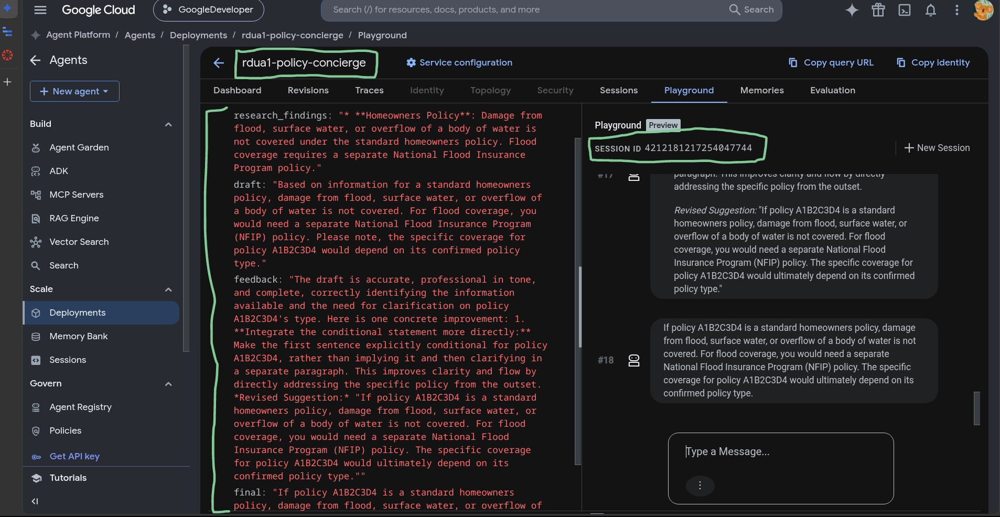 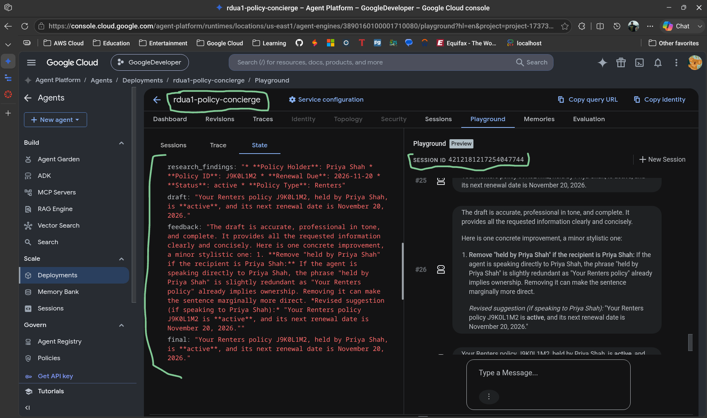 | Console View |
| Phase-3 | 3 | Filtering and Finding Traces in Trace Explorer | `Console > Trace > Trace Explorer` | 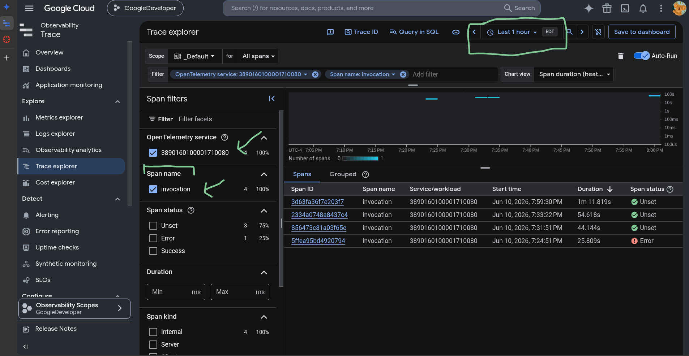 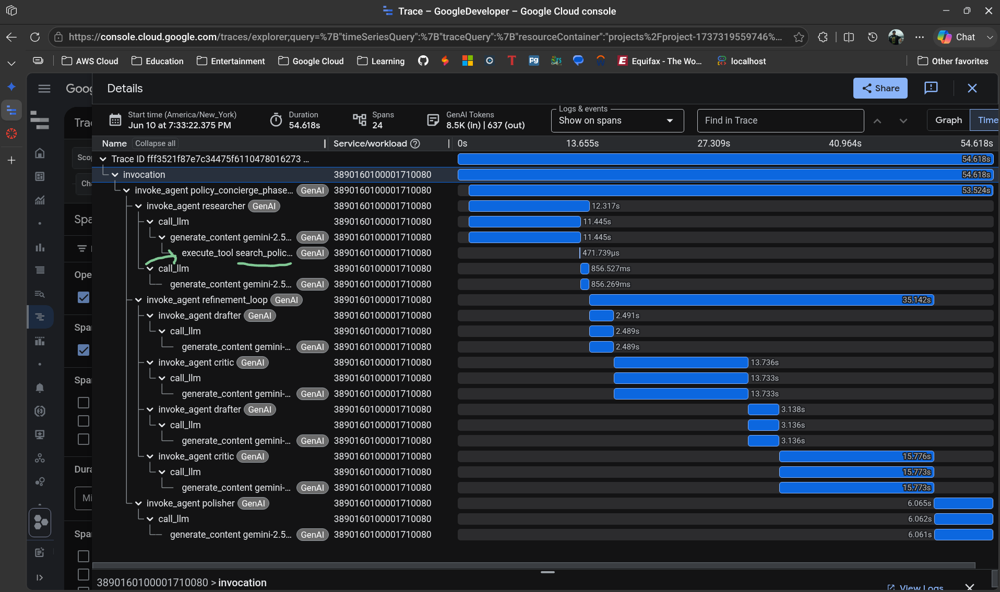 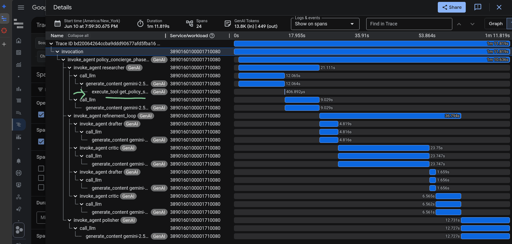 | Console View |
---

