

| Assignment | Student   |
| ---------- | --------- |
| Module-6   | Robin Dua |

---

| Part | Step | Description | gcloud cli command (bash) or console | Results (ScreenPrint) | Notes |
| :--- | :--- | :---------- | :----------------------------------- | :-------------------- | :---- |
| Pre-Task | 1 | Create Bucket | Create Cloud Storage Bucket  `gcloud storage buckets create gs://rdua1-stevens-swe-20049317 \` `--location=us-east1 \` `--default-storage-class=standard` |  | I already had this bucket from previous modules, so used it instead of creating another bucket |
| Pre-Task | 2 | Train model from a public, claims-flavored dataset.  | [Please Refer Here For Code (GitHub)](./pre_task/make_starter.py) | 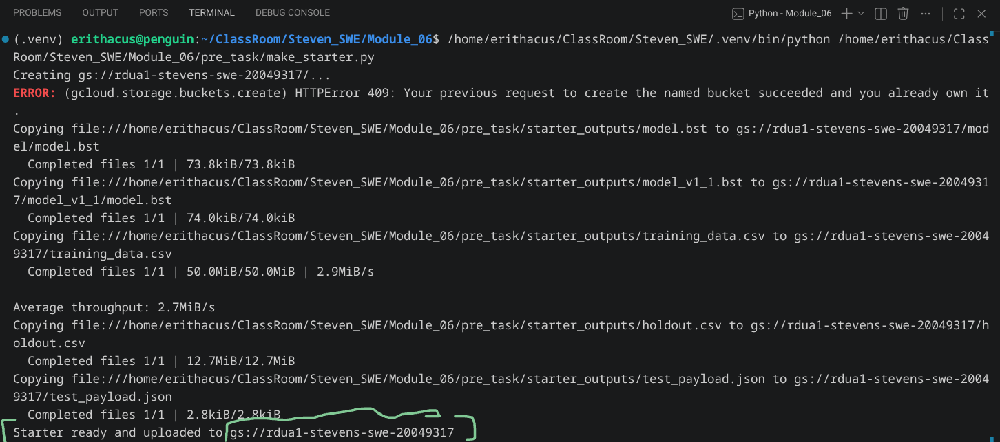 It also produces output files, please refer them [here](./pre_task/starter_outputs/). | Local Testing |
---

 
 
 

| Part | Step | Description | gcloud cli command (bash) or console | Results (ScreenPrint) | Notes |
| :--- | :--- | :---------- | :----------------------------------- | :-------------------- | :---- |
| Task-1 | 1 | Evaluate Model | [Please Refer the Code (GitHub) Here](./task_01/evaluate.py) | 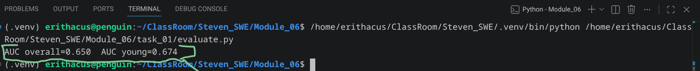 | Local Testing |
| Task-1 | 2 | Model Registry | [Please Refer the Code (GitHub) Here](./task_01/register.py) | 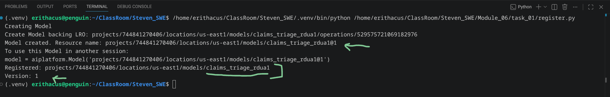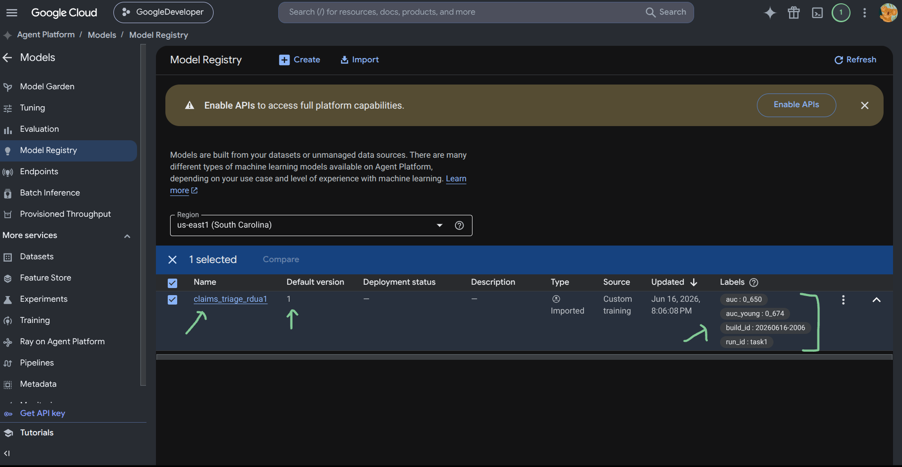 | Local Testing |
| Task-1 | 3 | Model Card | | [Please Refer Model Card Here](./task_01/model_card.md) | |
---

 
 
 

| Part | Step | Description | gcloud cli command (bash) or console | Results (ScreenPrint) | Notes |
| :--- | :--- | :---------- | :----------------------------------- | :-------------------- | :---- |
| Task-2 | 1 | Deploy Model To Agent Platform (Vertex AI) | [Please Refer Here For Code (GitHub)](./task_02/deploy.py) | 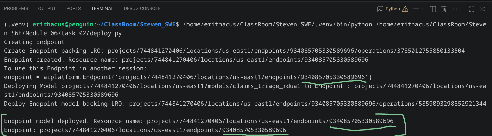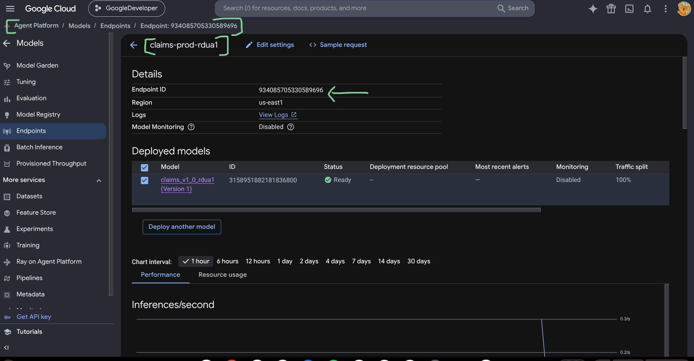 | Terminal & Console View |
| Task-2 | 2 | Smoke Test Deployed Model On Agent Platform (Vertex AI) | [Please Refer Here For Code (GitHub)](./task_02/endpoint_smoke_test.py) | 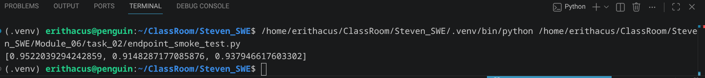 | Terminal View |
---

 
 
 

| Part | Step | Description | gcloud cli command (bash) or console | Results (ScreenPrint) | Notes |
| :--- | :--- | :---------- | :----------------------------------- | :-------------------- | :---- |
| Task-3 | 1 | Register Model V1.1 | [Please Refer Here For Code (GitHub)](./task_03/register_v1_1.py) | 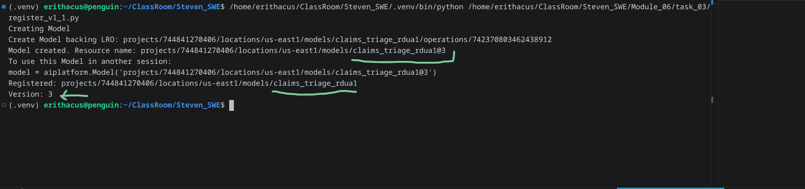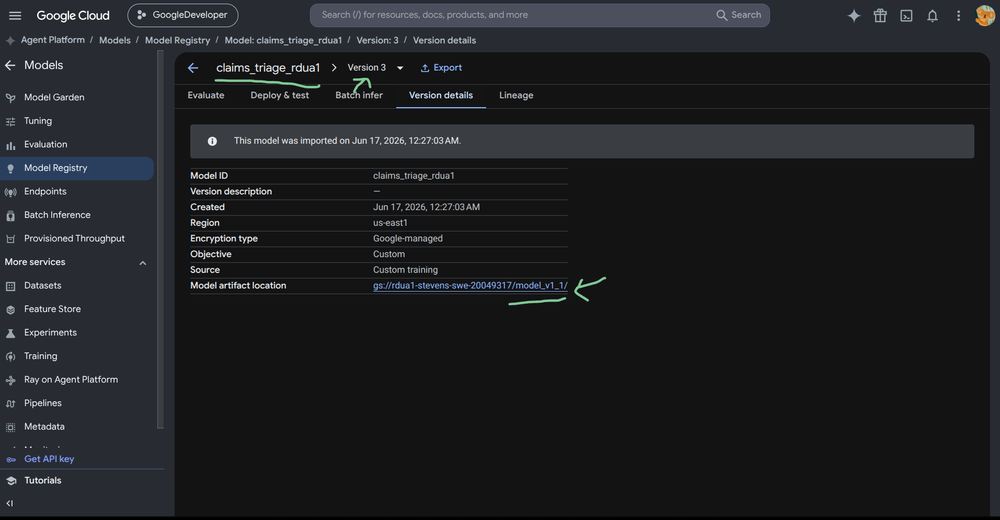 | Terminal & Console View  |
| Task-3 | 2 | Deploy Model V1.1 & Test 90, 10 Traffic Split | [Please Refer Here For Code (GitHub)](./task_03/deploy_v1_1.py) | 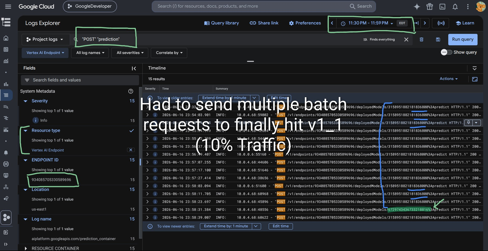 You can also refer the logs [here](./evidence/task_03/downloaded-logs-20260617-093826.csv) | Logs Console View |
| Task-3 | 3 | Roll Up & Move Production Aliases | 1: [Please Refer Here For Code (GitHub)](./task_03/canary_rollout.py) | 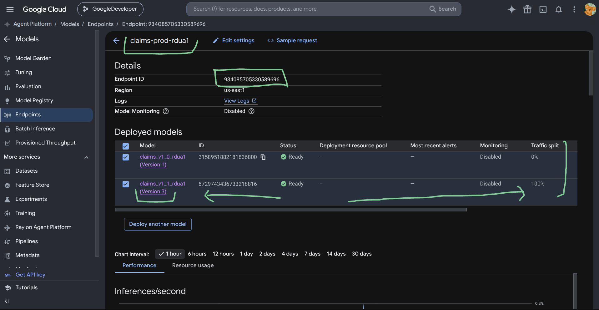 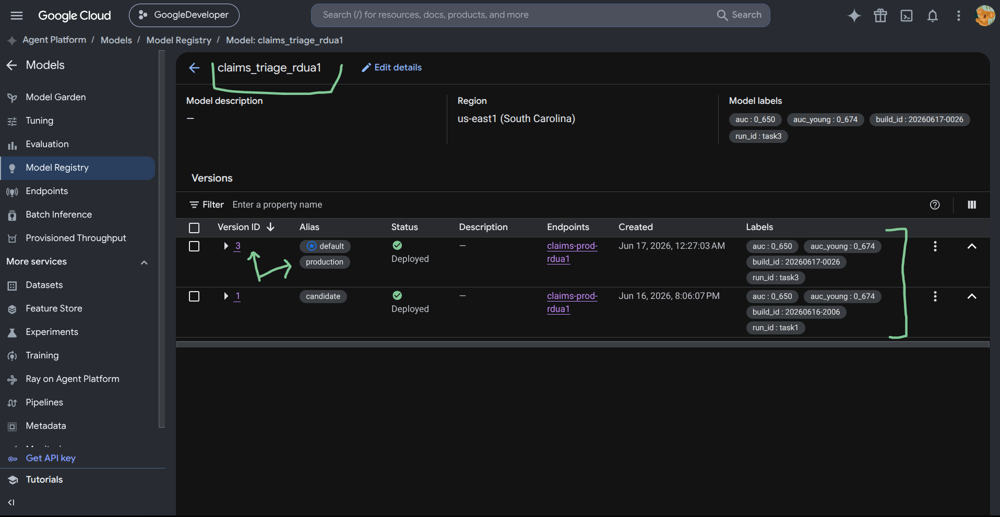 | Console View |
| Task-3 | 4 | Roll Back | 1: [Please Refer Here For Code (GitHub)](./task_03/canary_rollout.py) | 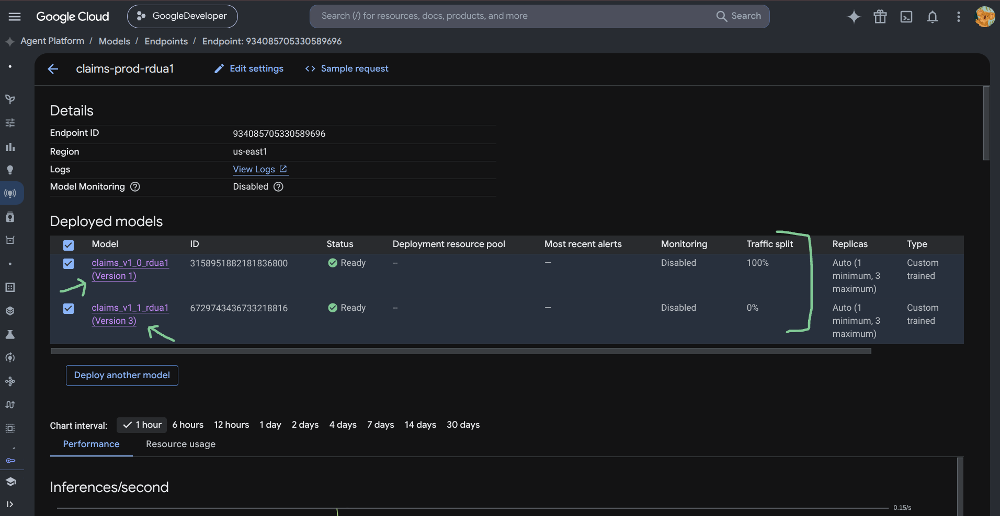 | Console View |
---

 
 
 

| Part | Step | Description | gcloud cli command (bash) or console | Results (ScreenPrint) | Notes |
| :--- | :--- | :---------- | :----------------------------------- | :-------------------- | :---- |
| Task-4 | 1 | Enable Model Monitoring On Endpoint | | 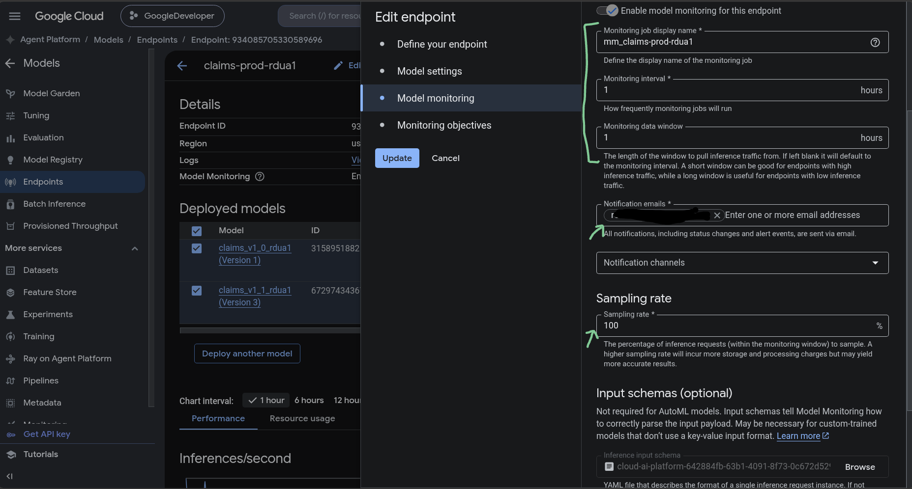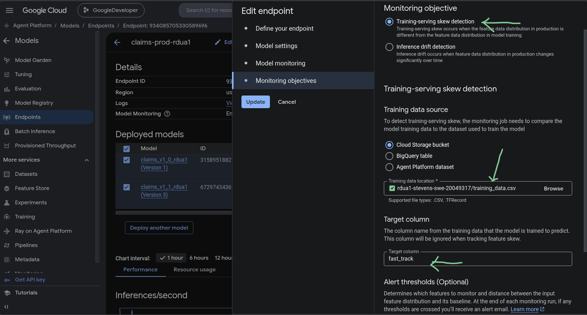 | Console View  |
| Task-4 | 2 | Send Some Valid Traffic For Monitoring Job To Learn Schema So its State Changes from PENDING to RUNNING | 1: [Please Refer Here For Code (GitHub)](./task_03/canary_rollout_testing.py)   2: List the monitoring jobs: `gcloud ai model-monitoring-jobs list \` `--region=us-east1`  3: Get The State of your configured job:  `gcloud ai model-monitoring-jobs describe 1870567590095486976 \` `--region=us-east1 \` `--format="value(state)"`| 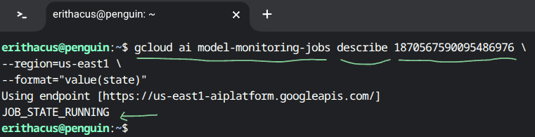 | Terminal View |
| Task-4 | 3 | Inject Skew (Skew Testing) | [Please Refer Here For Code (GitHub)](./task_04/inject_skew.py) | | |
| Task-4 | 4 | Set Budget Alert @ Project (Environemnt) Level | | 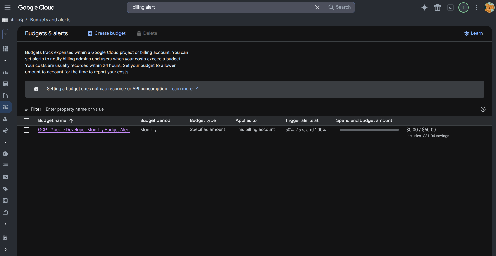 | Console View   At Hartford, Each Environment gets its own Project, hence budget is set project level |
| Task-4 | 5 | Runbook | | [Please Refer Here](./runbook.md) | |
---

 
 
 

| Part | Step | Description | gcloud cli command (bash) or console | Results (ScreenPrint) | Notes |
| :--- | :--- | :---------- | :----------------------------------- | :-------------------- | :---- |
| Task-5 | 1 | Reflection | | [Please Refer Here](./reflection.md) | |
---

