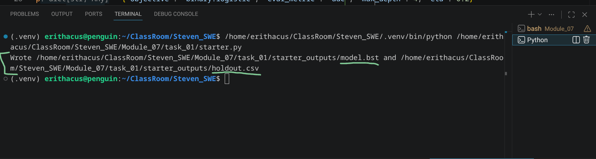
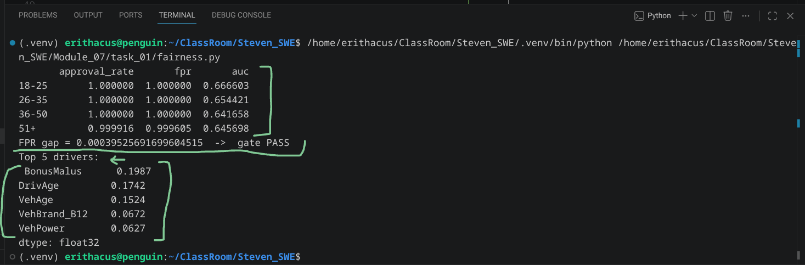
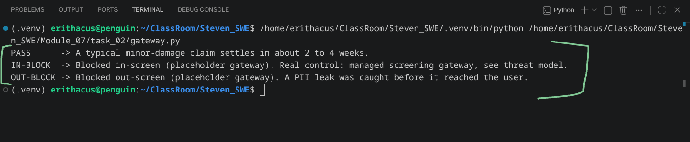
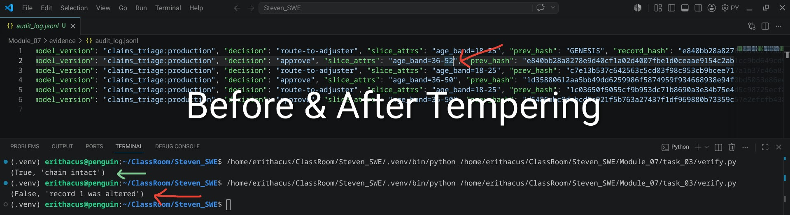
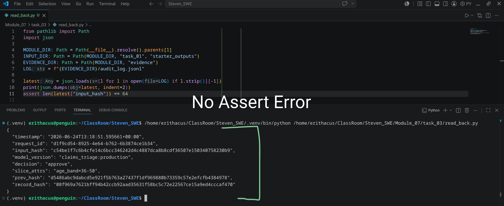
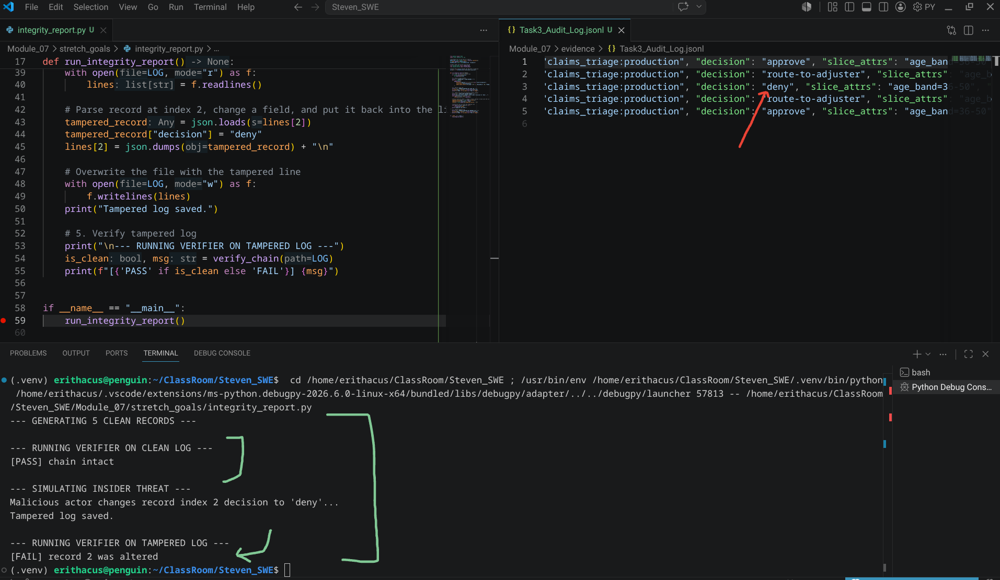

| Assignment | Student   |
| ---------- | --------- |
| Module-7   | Robin Dua |

---

| Part | Step | Description | gcloud cli command (bash) or console | Results (ScreenPrint) | Notes |
| :--- | :--- | :---------- | :----------------------------------- | :-------------------- | :---- |
| Task-1 | 1 | Train A Model Locally | [Please Refer starter.py](./task_01/starter.py) |  | Terminal View |
| Task-1 | 2, 3 | Compute Per-Slice Fairness Metric And Top-5 SHAP Drivers | [Please Refer fairness.py](./task_01/fairness.py) |   This script also produced CSV output, please refer it [here](./evidence/Task1_Slice_Metrics.csv) | Local Testing/Terminal View |
| Task-1 | 4 | Model Card | | [Please refer Model Card](./rdua1-m7-model-card.md) | |
---

 
 
 

| Part | Step | Description | gcloud cli command (bash) or console | Results (ScreenPrint) | Notes |
| :--- | :--- | :---------- | :----------------------------------- | :-------------------- | :---- |
| Task-2 | 1 | Screening Gateway Threat Model | | [Screening Gateway Threat Model](./task_02/screening-gateway-threat-model.md) | |
| Task-2 | 2, 3 | request-path harness (gateway.py) & testing | [Please Refer gateway.py (GitHub) Here](./task_02/gateway.py) |  | Local Testing |
---

 
 
 

| Part | Step | Description | gcloud cli command (bash) or console | Results (ScreenPrint) | Notes |
| :--- | :--- | :---------- | :----------------------------------- | :-------------------- | :---- |
| Task-3 | 1 | Chained Audit Record | [Please Refer audit.py (GitHub)](./task_03/audit.py) | [Audit_Log.jsonl](./evidence/Task3_Audit_Log.jsonl) | Local Testing |
| Task-3 | 2 | Verify the Audit Chain With Clean & Tempered Logs | [Please Refer verify.py (GitHub)](./task_03/verify.py) |  | Terminal View |
| Task-3 | 3 | Query One Record Back | [Please Refer read_back.py (GitHub)](./task_03/read_back.py) |  | Terminal View (No Assert Error) |
---

 
 
 

| Part | Step | Description | gcloud cli command (bash) or console | Results (ScreenPrint) | Notes |
| :--- | :--- | :---------- | :----------------------------------- | :-------------------- | :---- |
| Task-4 | 1, 2, 3 | Governance Pack  1: EU AI Act high-risk mapping 2: NAIC governance attestation 3: Trust Readiness  hecklist | | [Please Refer All 3 Here (GitHub)](./task_04/governance_pack_and_checklist.md) |  |
---

 
 
 

| Part | Step | Description | gcloud cli command (bash) or console | Results (ScreenPrint) | Notes |
| :--- | :--- | :---------- | :----------------------------------- | :-------------------- | :---- |
| Stretch-Goals | 2 | Chain integrity report | [Please Refer integrity_report.py (GitHub)](./stretch_goals/integrity_report.py)|  | Local Testing/Terminal View  |
| Stretch-Goals | 3 | Screen the integration point on a tool call | | [Please Refer Updated Threat Model](./stretch_goals/screening-gateway-threat-model.md) | |
---

